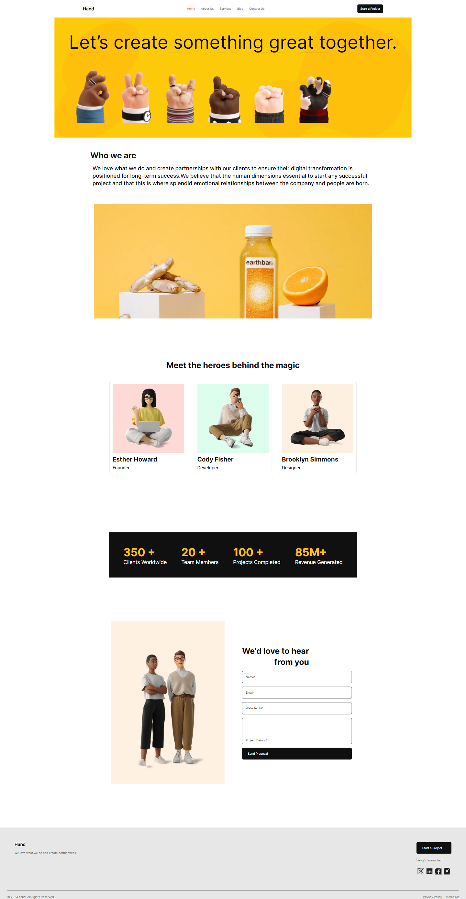
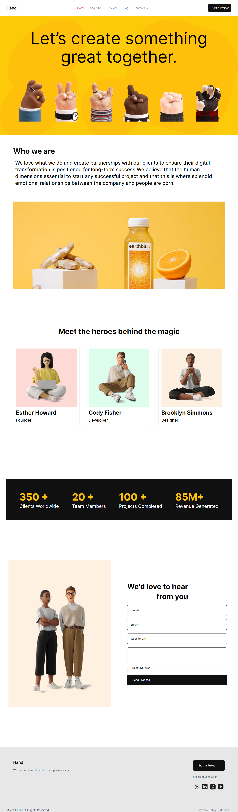
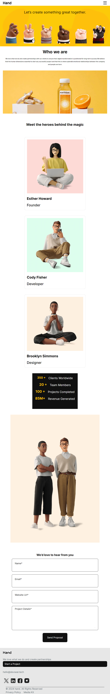

## Frontend Intern Challenge

This is the task given for a frontend Intern position

## Table of contents

- [The Challenge](#the-challenge)
- [Process](#process)
- [Links](#links)
- [Technologies used](#technologies-used)
- [Screenshots](#screenshot)
- [Resources](#resources)
- [Get in Touch](#get-in-touch)

## The Challenge

The task is to replicate a figma design ensuring pixel perfect design

## Process

This is the processes I used for the application:
I created different Components:

- Navbar/: The navigation bar component
- Hero/: The hero section component
- Who/: The "Who we are" section component
- Metrics/: The metrics section component
- Team/: The team section component
- Contact/: The contact section Component
- ContactForm/: The form component for the contact section
- Footer/: The footer component

page.js: This is the main page component that I use to render the entire application

I downloaded all the assets and compress the ones with png format with TinyPng

### To view 

1. Run npm install to install dependencies
2. Run npm run dev to start the development server

### Links

- Solution URL: [code](https://github.com/Ehmkayel/project-hand)
- Live Site URL: [Hand]()

### Technologies Used

- Next.js
- HTML
- TailwindCss
- React.js
- Google Fonts
- React Icons

### Screenshots

- Desktop View

- Large Laptop[1440px] view

- Laptop View

- Tablet View

## Resources

[TailwindCss Documentation](https://tailwindcss.com/docs/installation)
[Next Js Documentation](https://nextjs.org/docs)
[TinyPng](https://tinypng.com/)
[React Icons](https://www.npmjs.com/package/react-icons)

## Get in Touch

You can reach out to me;
 - Linkedin- [Morufat-Lamidi](https://linkedin.com/in/morufat-lamidi)
 - Frontend Mentor - [@Ehmkayel](https://www.frontendmentor.io/profile/Ehmkayel)
 - Twitter - [@kamalehmk](https://www.twitter.com/kamalehmk)
 - Gmail- [Mail](mailto:lamidimorufat0@gmail.com);

